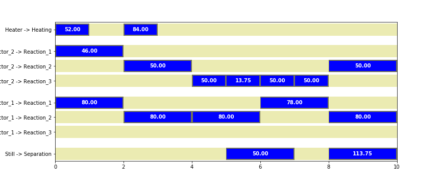

# STN Scheduler

The State-Task Network (STN) is a method for modeling and scheduling multipurpose batch processes developed by Kondili, et al., in 1993, and extended by others. 

This repository consists of a python module STN to assist in the modeling and scheduling of State Task Networks, and Jupyter notebooks demonstrating their use. 

* [Overview of STN Scheduler (to be finished)](http://nbviewer.jupyter.org/github/jckantor/STN-Scheduler/blob/master/notebooks/0_Overview.ipynb)
* [State Task Network Example of Kondili, et. al, 1993](http://nbviewer.jupyter.org/github/jckantor/STN-Scheduler/blob/master/notebooks/1_Kondili_State_Task_Network.ipynb).
* [State Task Network Example of Chu, et. al, 2013](http://nbviewer.jupyter.org/github/jckantor/STN-Scheduler/blob/master/notebooks/2_Chu_State_Task_Network.ipynb).
* [Example from Maravelias and Grossmann, 2003](http://nbviewer.jupyter.org/github/jckantor/STN-Scheduler/blob/master/notebooks/4_Maravelias_Grossmann_Example_A.ipynb).
* [Classroom Case Study of a Multipurpose Batch Fermentation Plant (to be finished)](http://nbviewer.jupyter.org/github/jckantor/STN-Scheduler/blob/master/notebooks/3_Multipurpose_Fermentation_Plant.ipynb).

This module implements the STN model using the Pyomo package for building optimization models in [Python](http://www.pyomo.org/), and requires an MILP solver to compute schedules.

## Dependencies

* [Pyomo](http://www.pyomo.org/)
* An MILP solver is required for computing solutions to the MILP scheduling problems. The module has been tested with GLPK and Gurobi.

## Related Projects

* [pySTN](https://github.com/robin-vjc/pySTN) Implementation of a robust scheduling system based on STN (State-Task-Network) models.

## References

Floudas, C. A., & Lin, X. (2005). Mixed integer linear programming in process scheduling: Modeling, algorithms, and applications. Annals of Operations Research, 139(1), 131-162.

Harjunkoski, I., Maravelias, C. T., Bongers, P., Castro, P. M., Engell, S., Grossmann, I. E., ... & Wassick, J. (2014). Scope for industrial applications of production scheduling models and solution methods. Computers & Chemical Engineering, 62, 161-193.

Kondili, E., Pantelides, C. C., & Sargent, R. W. H. (1993). A general algorithm for short-term scheduling of batch operations—I. MILP formulation. Computers & Chemical Engineering, 17(2), 211-227.

Maravelias, C. T., and Grossmann (2003). New General Continuous-Time State−Task Network Formulation for Short-Term Scheduling of Multipurpose Batch Plants. Industrial & Engineering Chemistry Research, 42 (13), 3056-3074.

Méndez, C. A., Cerdá, J., Grossmann, I. E., Harjunkoski, I., & Fahl, M. (2006). State-of-the-art review of optimization methods for short-term scheduling of batch processes. Computers & Chemical Engineering, 30(6), 913-946.

Shah, N., Pantelides, C. C., & Sargent, R. W. H. (1993). A general algorithm for short-term scheduling of batch operations—II. Computational issues. Computers & Chemical Engineering, 17(2), 229-244.

Wassick, J. M., & Ferrio, J. (2011). Extending the resource task network for industrial applications. Computers & chemical engineering, 35(10), 2124-2140.
